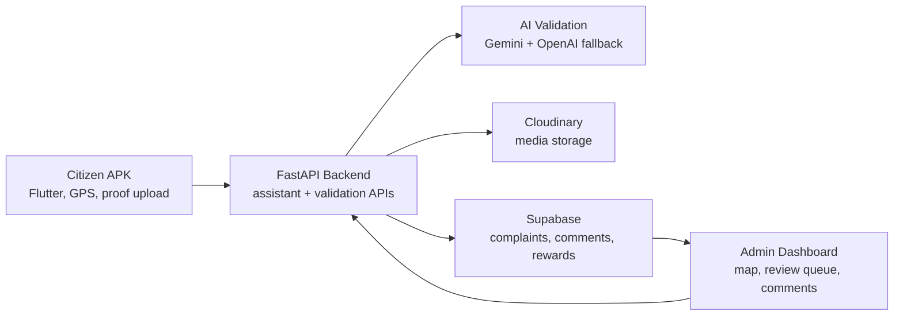
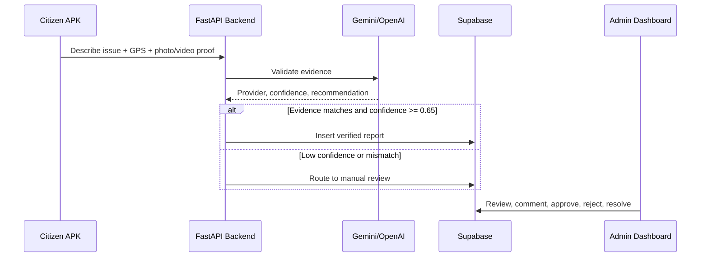

# Community Hero / CityPulse — AI & GEO-Based Civic Issue Reporting and Management System

<p align="center">
  
  
  
  
  
  
</p>

---

## Submission Package

**Author:** kartikeya  
**Selected Problem Statement:** Community Hero - Hyperlocal Problem Solver

This repository contains the complete CityPulse civic-tech platform: a Flutter citizen APK, FastAPI AI backend, Supabase/Cloudinary data layer, and React admin dashboard. The submission-ready project description is available at:

- [Submission Project Description](docs/SUBMISSION_PROJECT_DESCRIPTION.md)
- [Project Description DOCX](docs/CityPulse_Project_Description_Kartikeya.docx)

> For the required Google Doc submission, upload/import `docs/CityPulse_Project_Description_Kartikeya.docx` into Google Docs and set sharing to "Anyone with the link can view."

### Current Screenshots

**Citizen APK layout**


**Admin dashboard**


### Platform Flow



### Report Verification Flow



---

## Overview

**CityPulse** is a full-stack, AI-augmented civic issue management platform that spans a citizen-facing Flutter mobile app, a FastAPI AI backend, and an admin web dashboard. Citizens photograph road potholes from their phones; the backend validates the image with a custom-trained TensorFlow classifier, scores its severity using a hybrid OpenCV + model approach, generates a structured description via Google Gemini, and persists the complaint to a Supabase (PostgreSQL) database. Administrators resolve issues through a React dashboard that displays complaints geo-spatially on a live map and supports natural-language queries against the complaint database — translating plain English into SQL via a Groq-hosted LLM and rendering results as interactive charts.

---

## Problem Statement

**Selected Problem Statement:** Community Hero - Hyperlocal Problem Solver

Municipal authorities in Indian cities receive thousands of civic complaints daily through unstructured channels (phone calls, WhatsApp messages, paper forms). These pipelines suffer from:

- **No image verification** — fabricated or irrelevant photos are submitted freely.
- **No automated priority scoring** — every complaint receives the same weight regardless of actual damage severity.
- **No resolution accountability** — work-order closure can be self-reported without photographic proof.
- **No analytical tooling** — ward-level officers cannot quickly explore complaint trends without running manual SQL queries.

CityPulse addresses all four gaps in a single integrated system.

---

## Solution Approach

The system operates in two roles:

**Citizen (Flutter app)**
1. The citizen opens the app, selects an issue category (pothole, garbage, streetlight, water leak), and captures a photo using the device camera.
2. GPS coordinates are automatically attached to the submission.
3. The report is sent to the backend as a multipart form POST.

**Backend (FastAPI + AI pipeline)**
1. A MobileNetV2-based binary classifier (`pothole_classifier.h5`) validates that the submitted image actually contains a pothole. Fraudulent or unrelated images are rejected immediately, and the citizen is informed.
2. If valid, a hybrid severity score (1–10) is computed: 60 % from OpenCV pixel-area analysis of dark regions, 40 % from the classifier's confidence probability.
3. A feature embedding is extracted from the penultimate layer of the same model for downstream duplicate-detection use.
4. The image is uploaded to Cloudinary and a persistent URL is stored.
5. **Google AI Studio (Gemini 1.5)** generates a structured JSON payload detailing the issue summary, department routing, urgency score, and safety notes. Gemini is the core analytical engine.
6. All data is inserted into Supabase.

**Admin (React web dashboard)**
1. A live Leaflet map renders every complaint as a priority-coloured pin.
2. Clicking a pin opens a slide-in sidebar with the complaint photo, Gemini AI summary, coordinates, department, and community validations.
3. When an admin marks a complaint resolved, they must upload a "resolved image." A second TensorFlow model (`road_quality_classifier.h5`) validates that the road is genuinely clear before the status change is committed — preventing fraudulent closure.
4. The NL Query page accepts a plain-English question, translates it to PostgreSQL via **Google Gemini**, executes it against Supabase via an RPC, and renders the result as a chart using Recharts.

**Community Hero Features**
- Citizens can confirm/upvote an existing complaint, increasing its priority score.
- Duplicate reporting detection to avoid noise.

---

## Features

### Citizen Mobile App (Flutter / CityPulse)
- **Camera-only capture** — gallery access is intentionally blocked to prevent old or unrelated photo submissions.
- **Automatic GPS tagging** — latitude/longitude collected via `geolocator` at submission time.
- **Real-time ML rejection feedback** — the API returns `is_true_image: false` within ~2 seconds for invalid images.
- **Dark/light theme** — persisted via `shared_preferences` across sessions.
- **Riverpod state management** — clean separation of UI, provider, and repository layers.

### AI Backend (FastAPI)
- **Two-stage image validation pipeline** — separate models for complaint submission (`pothole_classifier.h5`) and resolution verification (`road_quality_classifier.h5`).
- **Hybrid severity scoring** — weighted blend of OpenCV pixel-ratio measurement (60%) and MobileNetV2 confidence score (40%), yielding a 1–10 severity integer stored in the database.
- **Feature embeddings** — L2-normalized 1280-dimensional vectors extracted from the penultimate layer, stored for future similarity search (e.g., detecting duplicate complaints within a radius).
- **LLM Core Intelligence** — Google AI Studio (Gemini 1.5) is the primary reasoning engine. It processes images, issue types, and locations to return structured JSON mapping the issue to urgency, department, safety risk, and a clean summary.
- **Gemini SQL Agent** — The system utilizes Gemini for NL-to-SQL translation with a strict `SELECT`-only and `LIMIT 100` prompt, guarded by a blocklist check.
- **Cloudinary image hosting** — images are never stored on the server disk beyond the processing window; only the CDN URL is persisted.
- **Fallback Mode** — If the large ML model files (`.h5`) are missing from the repo, the backend automatically enters a safe Fallback Mode so the app remains usable and API calls don't crash.

### Admin Web Dashboard (React + Vite)
- **Geo-spatial map** — React Leaflet with severity-coloured custom SVG markers. Switches between Google Maps (light mode) and CARTO Dark Matter tiles (dark mode) based on theme.
- **Predictive Hotspot Cards** — Visual impact cards at the top of the map showing metrics like critical complaints, total community confirmations, duplicate reports prevented, and top category, complete with a Gemini Insight generator button.
- **Slide-in complaint details sidebar** — animated via Framer Motion's spring physics, showing photo, AI description, coordinates, reporter, and submission time.
- **ML-gated resolution workflow** — admins upload a resolved image; the backend's road quality classifier must confirm the road is clear before the status update commits.
- **Advanced filtration table** — filter by issue type, status, and severity tier (High/Medium/Low); full-text search across ID, type, description, and username; click-to-sort on any column via `useMemo`.
- **Public Community Feed** — Citizen-facing feed `/community` displaying active civic issues, with capabilities for citizens to upvote/confirm or mark duplicate issues.
- **Citizen Leaderboard** — Gamified `/leaderboard` showing top reporters, assigning dynamic badges (Community Hero, Streetlight Watcher, Sanitation Hero), and measuring total confirmations.
- **Voice Reporting via Vapi** — An optional voice intake channel (`/voice-report`) utilizing Vapi.ai for real-time conversation parsing, with Gemini continuing to act as the core analytical engine to structure the data.
- **Optional Video-Ready Schema** — The Supabase schema supports `media_url` and `media_type` natively for future video uploads.
- **CSV export** — exports the current filtered view as a properly escaped CSV file, dated and named automatically.
- **Natural-language analytics** — voice or text input, multilingual (auto-translated via Google Translate API), generates SQL, executes it, and renders a themed Recharts chart (bar, line, or area).
- **Neumorphic custom alert system** — replaces native `window.alert()` with a designed notification component supporting `success`, `error`, `warning`, and `info` states.
- **Dark/light theme toggle** — persisted via React Context.

---

## Tech Stack

| Layer | Technology | Purpose |
|---|---|---|
| Mobile App | Flutter 3.x (Dart) | Cross-platform citizen-facing app |
| State Management | Riverpod 2.x | Reactive state, dependency injection |
| Mobile Navigation | GoRouter 14 | Declarative routing |
| Admin Frontend | React 19 + Vite 8 | Admin SPA |
| Mapping | React Leaflet 5 / flutter_map 7 | Geo-spatial complaint visualization |
| Animation | Framer Motion 12 | Sidebar, modal, and table transitions |
| Charts | Recharts 3 | NL Query result visualization |
| API Backend | FastAPI + Uvicorn | Async REST API |
| ML — Complaint Validation | TensorFlow 2.x (MobileNetV2) | Binary pothole classifier |
| ML — Resolution Validation | TensorFlow 2.x (MobileNetV2) | Road quality / clearance classifier |
| Computer Vision | OpenCV (`cv2`) | Pixel-area based severity estimation |
| LLM — AI Layer | Google AI Studio (Gemini) | Core issue analysis, department routing, and NL → SQL |
| Image Storage | Cloudinary | CDN hosting for complaint/resolution photos |
| Database | Supabase (PostgreSQL) | Cloud-hosted DB + SQL RPC endpoint |
| Environment Config | python-dotenv | Local secrets management |

---

## System Architecture

```
┌────────────────────────────────────────────────────────────────────────┐
│                        CITIZEN LAYER                                   │
│  ┌─────────────────────────────────────────────────────────────────┐  │
│  │  Flutter App (CityPulse)                                        │  │
│  │  Camera → GPS → Multipart POST to /upload_details              │  │
│  └──────────────────────────┬──────────────────────────────────────┘  │
└─────────────────────────────│──────────────────────────────────────────┘
                              │ HTTPS
┌─────────────────────────────▼──────────────────────────────────────────┐
│                        AI BACKEND (FastAPI)                            │
│                                                                        │
│  /upload_details POST                                                  │
│  ┌──────────────┐   reject   ┌─────────────────────────────────────┐  │
│  │ pothole_     ├───────────►│  Return {is_true_image: false}      │  │
│  │ classifier   │            └─────────────────────────────────────┘  │
│  │ .h5          │ accept                                              │
│  └──────┬───────┘                                                     │
│         │                                                              │
│  ┌──────▼───────────────────────────────────────────────────────────┐ │
│  │  Hybrid Severity (OpenCV pixel-ratio 60% + model prob 40% → 1–10│ │
│  │  Feature Embedding (L2-norm, 1280-dim, MobileNetV2 penultimate)  │ │
│  └──────┬───────────────────────────────────────────────────────────┘ │
│         │                                                              │
│  ┌──────▼──────────┐   ┌──────────────────┐   ┌───────────────────┐  │
│  │ Cloudinary      │   │ Google Gemini LLM │   │ Supabase INSERT   │  │
│  │ upload → URL    │   │ → complaint_desc  │   │ complaints table  │  │
│  └─────────────────┘   └──────────────────┘   └───────────────────┘  │
│                                                                        │
│  /update-complaint PUT                                                 │
│  ┌───────────────────────┐  reject  ┌──────────────────────────────┐  │
│  │ road_quality_         ├─────────►│ Return {success: false}      │  │
│  │ classifier.h5         │          └──────────────────────────────┘  │
│  └─────────┬─────────────┘  accept                                    │
│            │ upload resolved image → Cloudinary → UPDATE status in DB  │
│                                                                        │
│  /analyze (NL Query)                                                   │
│  ┌───────────────────────┐  ┌──────────────────────┐                  │
│  │ Gemini 1.5 Agent      ├─►│ SQL safety blocklist  │                 │
│  │ NL → SELECT SQL       │  │ → Supabase RPC        │                 │
│  └───────────────────────┘  └──────────────────────┘                  │
└────────────────────────────────────────────────────────────────────────┘
                              │
┌─────────────────────────────▼──────────────────────────────────────────┐
│                     ADMIN DASHBOARD (React + Vite)                     │
│                                                                        │
│  ┌──────────────┐  ┌──────────────────┐  ┌───────────────────────┐   │
│  │ Map View     │  │ Complaint Table  │  │ NL Query / Analytics  │   │
│  │ (Leaflet)    │  │ (Filter + Sort   │  │ (Voice → SQL →        │   │
│  │ Severity pins│  │  + CSV export)   │  │  Recharts)            │   │
│  └──────────────┘  └──────────────────┘  └───────────────────────┘   │
└────────────────────────────────────────────────────────────────────────┘
                              │
┌─────────────────────────────▼──────────────────────────────────────────┐
│                         DATA LAYER                                     │
│  Supabase (PostgreSQL) — complaints table                              │
│  Cloudinary CDN — complaint images + resolved images                  │
└────────────────────────────────────────────────────────────────────────┘
```

### Database Schema (complaints table)

| Column | Type | Notes |
|---|---|---|
| `id` | integer (PK) | Auto-increment |
| `username` | text | Submitting citizen |
| `issue_type` | text | pothole / garbage / streetlight / water_leak |
| `latitude` | float8 | GPS — from mobile |
| `longitude` | float8 | GPS — from mobile |
| `severity` | integer | 1–10, hybrid ML score |
| `complaint_desc` | text | Gemini-generated description |
| `image_url` | text | Cloudinary CDN URL |
| `resolved_image_url` | text | Cloudinary URL of resolution proof |
| `embedding` | vector / jsonb | 1280-dim MobileNetV2 feature vector |
| `upvotes` | integer | Default 1 |
| `status` | text | pending / onprogress / solved / rejected |
| `submitted_at` | timestamptz | UTC |

---

## Installation & Setup

### Prerequisites

- Python 3.10+
- Node.js 20+
- Flutter SDK 3.5+
- A Supabase project with the `complaints` table and an `execute_sql` RPC function
- Cloudinary account (free tier is sufficient)
- Google AI Studio API key (Gemini)
- Groq API key

---

### 1. Clone the Repository

```bash
git clone https://github.com/vishaaljr/AI-and-GEO---Based-Civic-Issue-Reporting-And-Management-System.git
cd "AI-and-GEO---Based-Civic-Issue-Reporting-And-Management-System"
```

---

### 2. Backend Setup

```bash
cd backend/Team-Try

# Create and activate a virtual environment
python -m venv venv
venv\Scripts\activate          # Windows
# source venv/bin/activate     # macOS / Linux

# Install all dependencies
pip install -r ../requirements.txt
```

Create `backend/.env` (one level above `Team-Try/`) or copy from `.env.example`:

```env
SUPABASE_URL=https://<your-project-ref>.supabase.co
SUPABASE_KEY=<your-supabase-anon-key>
GEMINI_API_KEY=<your-google-ai-studio-key>
CLOUD_NAME=<your-cloudinary-cloud-name>
CLOUD_API_KEY=<your-cloudinary-api-key>
CLOUD_API_SECRET=<your-cloudinary-api-secret>
```

> **Note on Fallback Mode:** The two model files (`pothole_classifier.h5` and `road_quality_classifier.h5`) are large and missing from the repo. The backend will automatically detect their absence and start in **Fallback Mode** (mocking successful image validations) so the API remains testable for the hackathon.

Start the API server:

```bash
# From inside backend/Team-Try/
uvicorn main:app --reload --host 0.0.0.0 --port 8000
```

API is now live at `http://localhost:8000`. Auto-generated docs available at `http://localhost:8000/docs`.

---

### 3. Admin Frontend Setup

```bash
cd "Admin frontend"
# Create .env from .env.example
cp .env.example .env
npm install
npm run dev
```

Dashboard is served at `http://localhost:5173`.

> The frontend uses `VITE_API_BASE_URL` from `.env` to communicate with the backend.

---

### 4. Flutter App Setup

```bash
cd Civic-App
flutter pub get
flutter run
```

To build a release APK:

```bash
flutter build apk --release
```

> Ensure your device/emulator has location permissions enabled. The app requests `geolocator` and `camera` permissions at runtime via `permission_handler`.

---

### 5. Supabase — Required RPC Function

The NL Query feature executes dynamic SQL via a Supabase RPC. Create this function in your Supabase SQL editor:

```sql
CREATE OR REPLACE FUNCTION execute_sql(query text)
RETURNS json
LANGUAGE plpgsql
SECURITY DEFINER
AS $$
DECLARE
  result json;
BEGIN
  EXECUTE 'SELECT json_agg(t) FROM (' || query || ') t' INTO result;
  RETURN result;
END;
$$;
```

---

## Usage Instructions

### Submitting a Complaint (Mobile App)
1. Open the CityPulse app and log in.
2. Tap **Report Issue** and select an issue category.
3. Tap the camera button — the app captures a live photo only (no gallery).
4. Tap **Submit**. The backend validates the image and returns the AI-generated complaint description and severity score within a few seconds.
5. A confirmation screen shows the assigned severity and description.

### Managing Complaints (Admin Dashboard)

**Map View (`/`)**
- All complaints are rendered as geo-spatial pins. Green = severity 1–2, Amber = 3–4, Red = 5–10.
- Click any pin to open the slide-in sidebar with full complaint details.
- Click **Update Status** → select a new status → upload a resolved image → click **Submit Update**. The backend validates the image before committing.

**Complaint Table (`/filter`)**
- Filter by Issue Type, Status, and Severity tier simultaneously.
- Full-text search across ID, type, description, and username.
- Click column headers to sort ascending/descending.
- Click **Export to Excel (CSV)** to download the current filtered view.

**AI Analytics (`/analyze`)**
- Type a question in plain English, e.g.:
  - *"Show complaints by issue type as a bar chart"*
  - *"Display complaints submitted over time as a line chart"*
  - *"Which areas have the highest severity potholes?"*
- Or click the microphone icon to speak your query in any language (auto-translated to English via Google Translate).
- Results are rendered as an interactive chart alongside the generated SQL query.

---

## Folder Structure

```
Civic app/
├── backend/
│   ├── requirements.txt            # All Python dependencies
│   └── Team-Try/
│       ├── main.py                 # FastAPI app — all route definitions
│       ├── pothole_classifier.h5   # Trained MobileNetV2 (complaint validation)
│       ├── road_quality_classifier.h5  # Trained MobileNetV2 (resolution validation)
│       ├── model/
│       │   ├── classifier.py       # Pothole detection + hybrid severity scoring
│       │   ├── classifier2.py      # Road quality / clearance detection
│       │   └── models.py           # Pydantic schemas (QueryRequest)
│       ├── services/
│       │   ├── cloudinary.py       # Image upload → Cloudinary CDN
│       │   ├── embedding.py        # PyTorch MobileNetV2 embedding (utility)
│       │   ├── llm.py              # Gemini API — complaint description generation
│       │   ├── llm_agent.py        # Groq API — NL to SQL translation + safety check
│       │   └── supabase.py         # Supabase client — insert, query, RPC
│       └── utils/
│           ├── config.py           # Loads env vars for Cloudinary
│           └── utils.py            # SQL blocklist safety function
│
├── Admin frontend/
│   ├── package.json                # React 19 + Vite 8 dependencies
│   ├── vite.config.js
│   └── src/
│       ├── App.jsx                 # React Router — 3 routes: /, /filter, /analyze
│       ├── main.jsx                # Entry point + ThemeContext provider
│       ├── components/
│       │   ├── Layout.jsx          # Shell: Sidebar + main content area
│       │   ├── Sidebar.jsx         # Navigation links + theme toggle
│       │   ├── MapSidebar.jsx      # Slide-in complaint detail + status update modal
│       │   ├── NeumorphicAlert.jsx # Custom styled notification component
│       │   └── ThemeToggle.jsx     # Dark/light mode switch
│       ├── pages/
│       │   ├── MapInterface.jsx    # Leaflet map — complaint pins + sidebar trigger
│       │   ├── FiltrationSystem.jsx # Filterable, sortable, exportable complaint table
│       │   └── NLQuery.jsx         # NL → SQL → chart analytics page
│       ├── services/
│       │   └── api.js              # fetchComplaints(), analyzeQuery() API calls
│       └── contexts/
│           └── ThemeContext.jsx    # Global theme state (dark / light)
│
└── Civic-App/                      # Flutter mobile app
    ├── pubspec.yaml                # Flutter dependencies
    └── lib/
        ├── main.dart               # App entry point, Riverpod ProviderScope, GoRouter
        ├── core/
        │   ├── constants/          # API URLs, app constants
        │   ├── routing/            # GoRouter app_router.dart
        │   ├── services/           # HTTP client, auth service
        │   ├── theme/              # AppTheme (light/dark) + ThemeController
        │   └── widgets/            # Shared reusable widgets
        └── features/
            ├── auth/               # Login / registration screens + controllers
            ├── citizen/            # Citizen home, submission flow
            ├── issues/             # Issue models, providers, repositories
            ├── admin/              # Admin-specific mobile screens
            └── common/             # Shared feature-level widgets
```

---

## Key Technical Highlights

### 1. Two-Model ML Pipeline
The system uses two independently trained MobileNetV2 models serving opposite validation roles:
- `pothole_classifier.h5` — binary classifier, trained to classify images as `pothole` (positive) vs. `normal road` (negative). Threshold: 0.7 probability.
- `road_quality_classifier.h5` — inverted: classifies images as `not clear` (damaged) vs. `clear` (repaired). Threshold: 0.5 probability. This prevents administrators from marking a complaint resolved without a genuinely repaired road in the photo.

### 2. Hybrid Severity Scoring
A single confidence score from the model would be too imprecise for prioritization. The implementation blends two independent signals:

```
severity_cv    = OpenCV dark-region pixel ratio × 20, clamped to [1, 10]
severity_model = model confidence × 10, clamped to [1, 10]
final_severity = int( 0.6 × severity_cv + 0.4 × severity_model )
```

The OpenCV method (GaussianBlur + binary threshold inversion) captures the visible damage area relative to the total frame size, which correlates with physical road damage extent more directly than the classifier's confidence alone.

### 3. Feature Embeddings for Duplicate Detection
Every validated complaint submission generates a 1280-dimensional L2-normalized feature vector from the MobileNetV2 penultimate layer. These embeddings are stored in Supabase and are structurally ready for cosine similarity queries (e.g., via `pgvector`) to detect duplicate complaints for the same pothole submitted by multiple citizens.

### 4. SQL Injection-Safe NL Agent
The Groq LLM agent is prompted with a strict system instruction to produce only SELECT queries with a LIMIT 100. The generated SQL is then checked against a blocklist:
```python
banned = ["delete", "drop", "update", "insert", "alter"]
```
Any query containing these words is rejected before reaching the database. The semicolon is also stripped before the Supabase RPC call.

### 5. Severity-Colour Map Pins on Leaflet
Markers are not standard Leaflet icons — they are inline SVG elements injected via `L.divIcon`, with a CSS `drop-shadow` filter whose colour matches the severity tier. This avoids external icon files and allows dynamic colour changes without re-loading assets.

### 6. Voice-to-Query with Multilingual Support
The NL Query page uses the `SpeechRecognition` Web API (supported natively by Chromium browsers) to capture audio, then pipes the transcript through the Google Translate public endpoint to normalize it to English before sending it to the backend. This allows a ward officer to ask `"இந்த மாதம் புகார்கள் எத்தனை?"` (Tamil: "How many complaints this month?") without any language-specific backend code.

---

## Challenges Faced & Solutions

| Challenge | Solution |
|---|---|
| ML models rejecting valid potholes (false negatives) | Tuned the decision threshold from the default 0.5 to 0.7 to bias toward recall; hybrid severity scoring compensates for single-model overconfidence. |
| Leaflet icon path broken in Vite/React | Deleted `L.Icon.Default.prototype._getIconUrl` and switched to fully custom `L.divIcon` SVG markers, eliminating the Webpack asset pipeline dependency entirely. |
| Admins bypassing resolution by marking "solved" without a real fix | Added a second ML model (`road_quality_classifier.h5`) as a hard gate on the `/update-complaint` endpoint. Status is only updated in the database if the model confirms a clear road. |
| LLM generating unsafe or malformed SQL | Combined prompt-level instruction (SELECT-only, LIMIT 100) with server-side keyword blocklist and semicolon stripping before query execution. |
| Voice input in regional languages not understood by the LLM | Translated `SpeechRecognition` transcript via the Google Translate public API before forwarding to the backend SQL agent. |
| Large `.h5` model files exceeding Git limits | Model files are excluded from version control via `.gitignore`. Reproducible training scripts and model architecture documentation serve as the source of truth. |

---

## Future Improvements

- **pgvector duplicate detection** — query the embedding column for cosine similarity `< 0.1` at submission time to surface likely duplicates and auto-merge citizen reports.
- **JWT authentication** — currently the citizen app sends a plain `username` field. Replacing with JWT tokens issued by Supabase Auth would enforce identity and enable per-user complaint history.
- **Push notifications** — notify citizens via FCM when their complaint status changes from `pending` to `onprogress` or `solved`.
- **Department routing** — auto-assign complaints to the relevant municipal department (road works vs. sanitation vs. electrical) based on `issue_type`, and expose department-specific dashboard views.
- **Upvoting** — other citizens in the same area should be able to upvote an existing complaint, raising its effective priority score for the admin dashboard.
- **Offline submission queue** — the Flutter app should cache complaint submissions locally when offline and sync when connectivity is restored.
- **Heatmap layer** — add a Leaflet heatmap overlay that visualizes complaint density per ward, helping administrators identify infrastructure hotspots at a glance.
- **CORS hardening** — replace the wildcard `allow_origins=["*"]` in FastAPI middleware with a production allowlist before deployment.

---

## Conclusion

CityPulse demonstrates the practical application of computer vision, large language models, and geo-spatial tooling within a real-world municipal workflow. The system's core value is not that it replaces human judgment, but that it eliminates the three most common points of failure in civic complaint pipelines: unverified submissions, subjective prioritization, and unaccountable resolution. The dual-model validation loop — one model to accept a complaint, a second to close it — is the architectural decision that makes the accountability guarantee technically enforceable rather than merely procedural.

---

## Team

**Final Year B.E. Project — AI & GEO-Based Civic Issue Reporting and Management System**

> Built with FastAPI · Flutter · React · TensorFlow · Google Gemini · Groq · Supabase · Cloudinary · Leaflet
