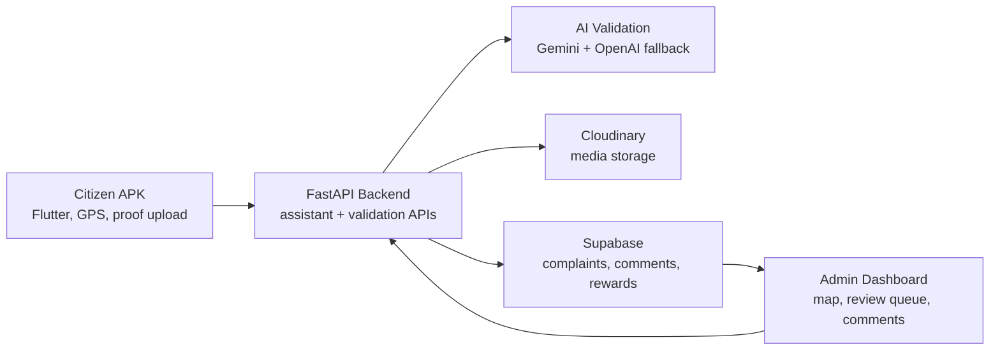
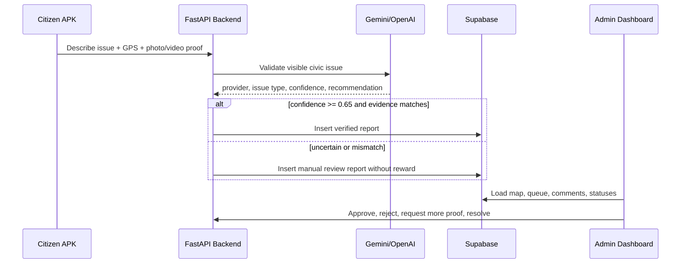
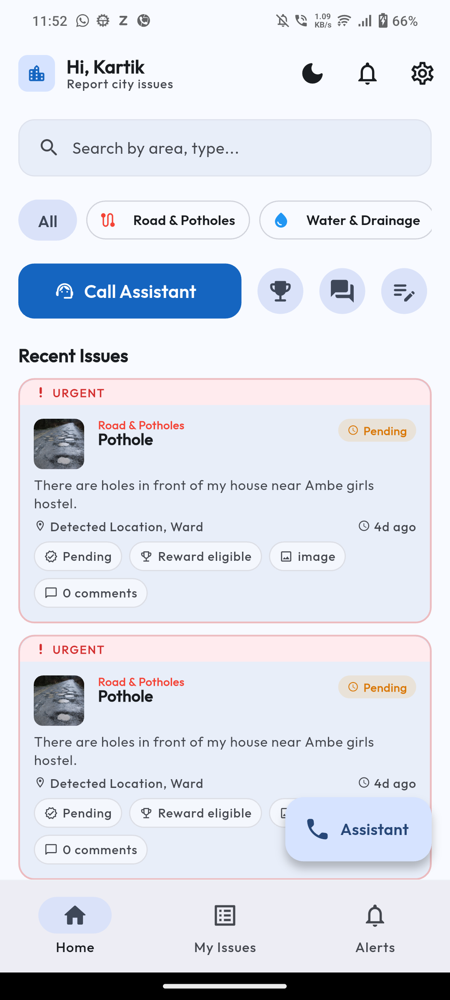
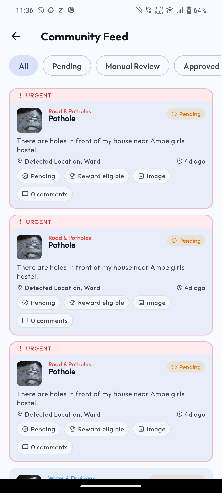
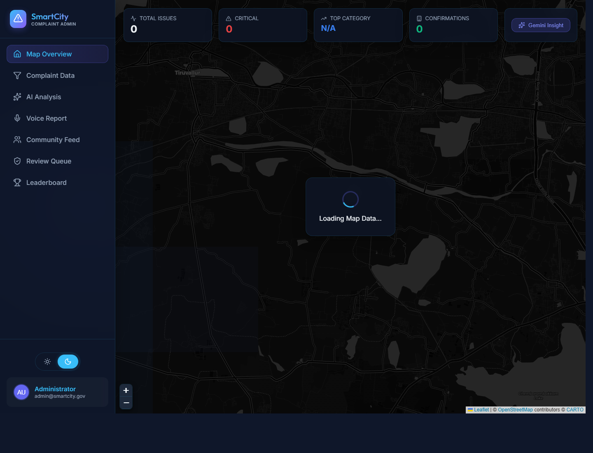
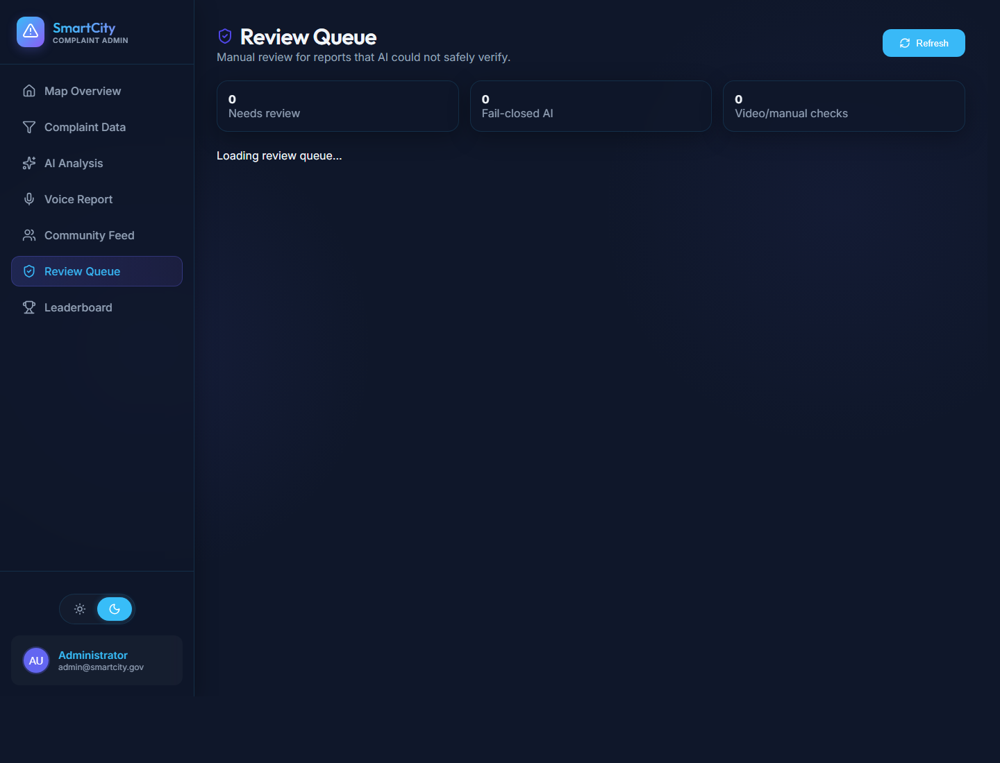

# CityPulse Project Description

**Author:** kartikeya  
**Problem Statement Selected:** Community Hero - Hyperlocal Problem Solver

CityPulse is an AI and GEO-based civic issue reporting and management platform. It connects a citizen-facing Flutter APK, a FastAPI AI backend, Supabase storage, Cloudinary media hosting, and a React admin dashboard so civic reports can be submitted, validated, reviewed, discussed, and resolved with stronger accountability.

## Solution Overview

Citizens use the mobile app to report potholes, water leakage, garbage, streetlight issues, and other local civic problems. The app supports assistant-led reporting, GPS capture, evidence upload, issue tracking, rewards, and a community feed. The backend validates evidence with Gemini vision and an OpenAI fallback, stores media in Cloudinary, persists records in Supabase, and exposes admin APIs. Administrators use the React dashboard to inspect live issues, review uncertain reports, manage statuses, and participate in community comments/replies.

## Report Flow

## Key Features

- Citizen APK with assistant-led reporting, GPS verification, proof upload, issue feed, My Issues, and community comments.
- AI evidence validation with Gemini and OpenAI fallback.
- Strict auto-submit gate: no automatic verified complaint without GPS, proof, matching issue evidence, and confidence threshold.
- Manual verification fallback for low-confidence or unsupported proof.
- Admin dashboard with map overview, manual review queue, community feed, complaint detail, status actions, and comments/replies.
- Status and label cleanup such as `water_leakage` to `Water Leakage`, `manual_review` to `Manual Review`, and `in_progress` to `In Progress`.
- Community discussion for both citizens and admins.
- Reward eligibility tied to verified/approved civic contribution.

## Technologies Used

| Layer | Technologies |
|---|---|
| Mobile | Flutter, Dart, Riverpod, GoRouter, speech_to_text, flutter_tts, geolocator, image_picker |
| Backend | FastAPI, Uvicorn, Python, multipart APIs, python-dotenv |
| AI | Google Gemini, OpenAI vision fallback |
| Data | Supabase PostgreSQL |
| Media | Cloudinary |
| Admin frontend | React, Vite, React Router, Leaflet, Recharts, Framer Motion |
| Dev/test | Android SDK, Gradle, physical Android phone testing, GitHub |

## Google Technologies Utilized

- Google Gemini for assistant planning, issue extraction, civic reasoning, and vision evidence validation.
- Android platform tooling for physical-device APK testing.
- Google Docs-compatible project description artifact generated as `docs/CityPulse_Project_Description_Kartikeya.docx`.

## Screenshots

### Citizen APK

### Admin Dashboard

## Submission Artifacts

- Project description DOCX: `docs/CityPulse_Project_Description_Kartikeya.docx`
- Citizen APK debug build: `Civic-App/build/app/outputs/flutter-apk/app-debug.apk` *(local build artifact, not committed unless explicitly requested)*
- Backend health checked at `http://192.168.18.165:8000/health` from the phone after VPN was disabled.

## Known Note

The citizen home and community feed are verified with live backend data on the physical Android phone. The issue-detail body had a phone-specific rendering issue during testing, so detail screenshots are not used as final submission proof.
